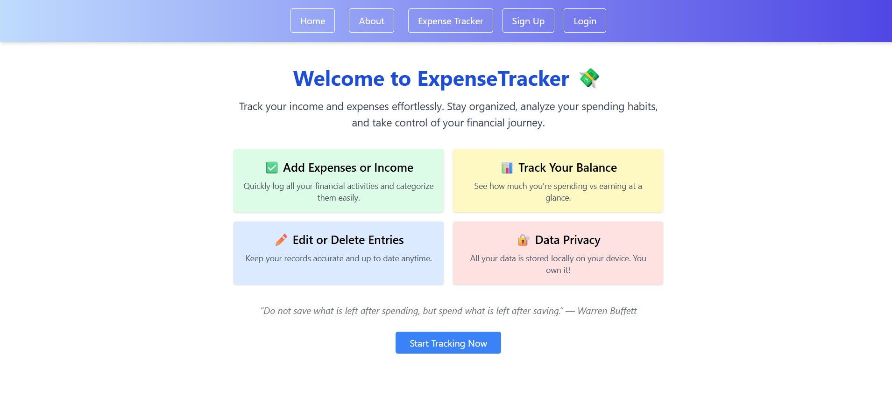
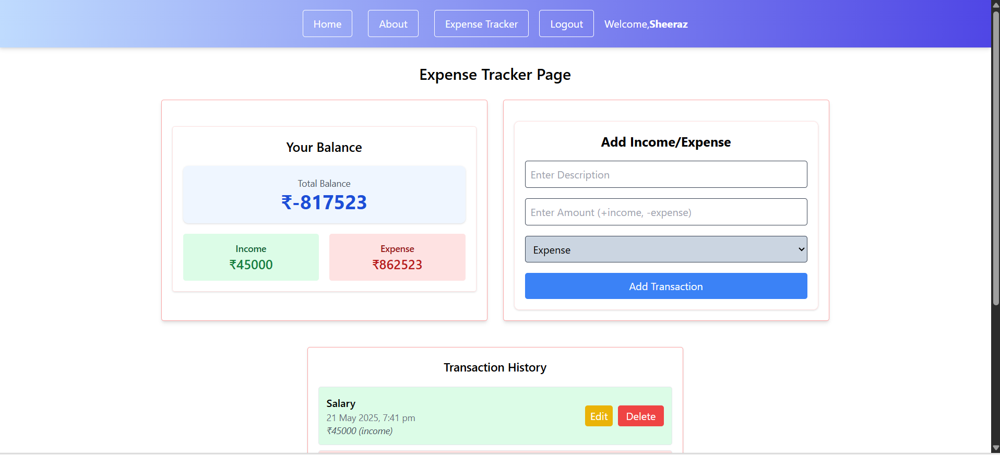

# 💸 Expense Tracker App

A sleek and modern **Expense Tracker** built with **React**, **Redux Toolkit**, and **Tailwind CSS** to help you manage your income and expenses with ease — all in one place.

Deployed live: 👉 [expense-tracker-sheeraz.vercel.app](https://expense-tracker-ruddy-nu.vercel.app/)

---

## 📸 Screenshot




---

## 🚀 Features

- ✍️ **Add/Edit/Delete** your income & expenses
- 📊 Real-time **balance** updates
- 🧠 Inline editing for a seamless experience
- 🕓 Tracks each transaction with a **timestamp**
- 👋 Personalized greeting with user’s name
- 🔐 **Login/Signup system** with session-based auth (no Firebase)
- 🌈 Fully responsive with Tailwind CSS
- ☁️ **LocalStorage** for offline persistence
- 🧭 Navigation with React Router + protected routes

---

## 🔧 Tech Stack

- ⚛️ React
- 📦 Redux Toolkit
- 🎨 Tailwind CSS
- 🔁 React Router
- 🍞 React Hot Toast (for beautiful alerts)
- 🛠️ LocalStorage (for auth and data)
- 🔄 Vercel for deployment

---

## 🧪 Demo

Try it live:  
🔗 [https://expense-tracker-ruddy-nu.vercel.app](https://expense-tracker-ruddy-nu.vercel.app)

---

## ✨ Getting Started (Local Setup)

```bash
git clone https://github.com/your-username/expense-tracker.git
cd expense-tracker
npm install
npm run dev

## 👨‍💻 Author
Made with ❤️ by Sheeraz Amin Dharekar